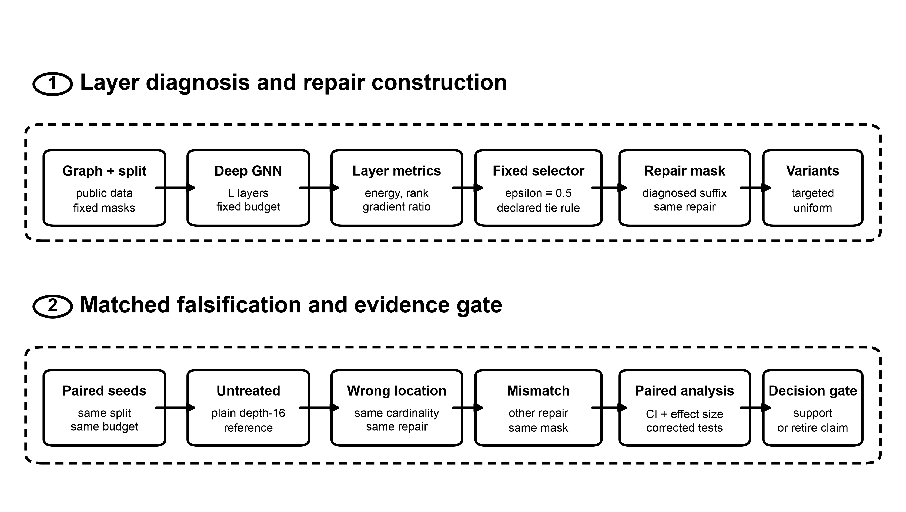

# Falsification-Guided Layer Repair

**A Matched-Control Protocol for Diagnosing and Repairing Deep Graph Neural Networks**

[](https://github.com/kacytran1122/falsification-guided-layer-repair/actions/workflows/quality.yml)

[Paper](paper/main.pdf) ·
[Experiment requirements](docs/EXPERIMENTS_REQUIRED.md) ·
[Reproducibility guide](docs/REPRODUCIBILITY.md) ·
[Artifact audit](docs/ARTIFACT_AUDIT.md)

Deep graph neural networks can lose predictive performance as message-passing depth increases. A layer statistic may correlate with that failure without identifying where an intervention causes recovery. This repository evaluates a falsification-guided protocol that separates repair viability, layer localization, and repair-type prescription through matched controls.

The released study is a real-data pilot on the public Planetoid Cora split. It contains 27 completed conditions from three seeds on one NVIDIA RTX A6000, the available layerwise diagnostics, plotting programs, integrity checks, and the IEEE manuscript source. It is not presented as a confirmed localization result.

[](results/figures/TNNLS_Fig3_Pipeline.pdf)

## Main result

The depth-16 pilot gives the following final Cora test accuracies. Values are means and sample standard deviations over three paired seeds.

| Condition | Test accuracy |
|---|---:|
| Plain GCN | `0.2553 ± 0.0725` |
| Targeted PairNorm | `0.5913 ± 0.0595` |
| Uniform PairNorm | `0.5887 ± 0.0592` |
| Wrong-location PairNorm | **`0.6373 ± 0.0580`** |
| Mismatched residual | `0.5663 ± 0.0607` |

Every repaired condition exceeded its paired untreated depth-16 run, which supports repair viability only within this pilot. Targeted repair did not outperform the wrong-location control, and the two masks had Jaccard overlap 0.875. The released evidence therefore does not support a layer-localization claim.

## Contributions

- A falsifiable hierarchy that tests repair viability before localization and repair prescription.
- Layerwise energy, effective-rank, and local-gradient-transmission diagnostics with an explicit selector.
- Targeted, uniform, same-cardinality wrong-location, and mismatched-repair controls.
- Machine-readable records from the completed RTX A6000 pilot.
- Evidence-faithful plotting and integrity checks that do not impute unavailable measurements.
- IEEE LaTeX source, compiled manuscript, and publication figures.

## Quick start

Python 3.10 or newer is recommended.

```bash
git clone https://github.com/kacytran1122/falsification-guided-layer-repair.git
cd falsification-guided-layer-repair
python3 -m venv .venv
source .venv/bin/activate
python -m pip install --upgrade pip
python -m pip install -r requirements.txt
```

Verify the released evidence and regenerate every supported figure:

```bash
python -m unittest discover -s tests -v
python scripts/plot_summary.py
python scripts/plot_diagnostics.py
```

The tests verify the record count, seed coverage, GPU metadata, condition coverage, and checksum of the exact depth-16 diagnostic subset.

## Repository structure

```text
src/pilot_harness.py           training and diagnostic implementation
data/                          compact result records and environment metadata
scripts/                       evidence-faithful figure generation
results/figures/               regenerated publication figures
tests/test_evidence.py         artifact integrity checks
paper/                         IEEE source, bibliography, figures, and review PDF
docs/EXPERIMENTS_REQUIRED.md   confirmatory experiments still required
docs/REPRODUCIBILITY.md        setup, verification, and RTX A6000 instructions
docs/ARTIFACT_AUDIT.md         evidence levels and missing artifacts
```

Raw Planetoid downloads, checkpoints, generated training directories, and LaTeX build files are excluded from Git. The compact release verifies the available evidence without claiming that absent run-time artifacts are reproducible.

## RTX A6000 retraining

The harness requires CUDA and refuses to label a CPU execution as A6000 evidence. Install the recorded-compatible environment and launch the complete pilot from the repository root:

```bash
python -m pip install -r requirements-a6000.txt
python src/pilot_harness.py --output runs/pilot --data data/planetoid
```

The command executes five untreated depth conditions and four depth-16 repair conditions for seeds 0, 1, and 2. A new execution is an independent replication and must not be represented as the original recorded run.

## Building the paper

With a TeX distribution containing `IEEEtran` and `latexmk` installed:

```bash
cd paper
latexmk -pdf -interaction=nonstopmode -halt-on-error main.tex
```

The committed review PDF is built from `paper/main.tex`. Its author field and PDF metadata use `Anonymous Authors`.

## Artifact integrity

The released bundle contains the compact 27-condition table and the exact 15-record depth-16 layerwise subset. It does not contain per-epoch histories, raw standard output or error logs, checkpoints, the complete 27-record per-layer manifest, or an environment lockfile captured from the remote system. Training and validation loss curves, accuracy curves, learning-rate curves, synchronized per-epoch timing, and bitwise retraining equivalence cannot be reconstructed from this release.

The depth-16 diagnostic subset has SHA-256:

```text
c1905c5feb70d6865e2e1b3f1bce31080c85ccebc1c2ef57a45c4668bc658c61
```

See the [artifact audit](docs/ARTIFACT_AUDIT.md) for the evidence boundary and [experiment requirements](docs/EXPERIMENTS_REQUIRED.md) for the work required before an effectiveness claim.

## Citation

This repository is anonymized for review. Refer to the artifact by title during review; replace this entry with the author-complete citation only after the review process permits disclosure.

```bibtex
@misc{falsification_guided_layer_repair_2026,
  title  = {Falsification-Guided Layer Repair for Deep Graph Neural Networks},
  author = {Anonymous Authors},
  year   = {2026},
  note   = {IEEE TNNLS submission and reproducibility artifact}
}
```

## License

The repository code is released under the MIT License. The Planetoid Cora dataset is downloaded from its upstream source and is not redistributed here.
